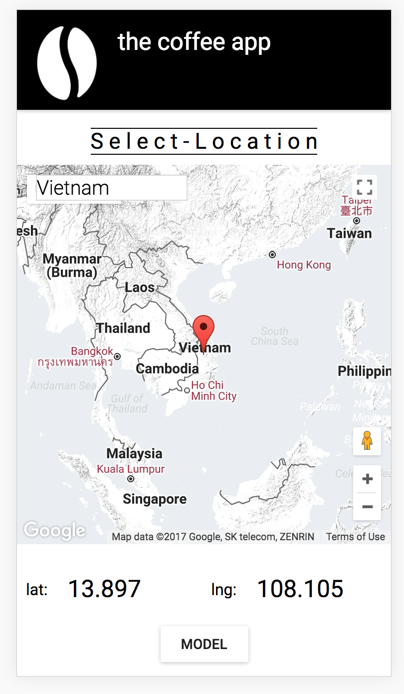
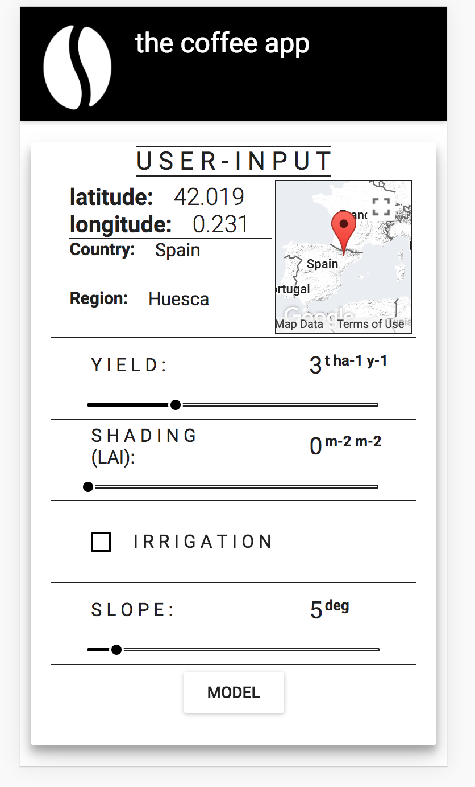

# the-coffee-app

The coffee app incorporates a state of the art eco-physiological model of coffee yield predictions allowing anyone to access coffee yield predictions from anywhere
in the world.

By running simulations we are also able to provide management advice for shade treatments.

The app is useful for coffee farmers and corporations to simulate shade management treatments before investing.

### Screen shots
Map Page                                     |                                      User Input |                                      Results |                                      Optimise
:-------------------------------------------:|:-----------------------------------------------:|:-------------------------------------------:|:-----------------------------------------------:
 | |  |  |

### Tech stack

React         |        redux |            R |           JS |          koa |              |google-maps
:------------:|:------------:|:------------:|:------------:|:------------:|:------------:|:------------:
 |  |  |  |  | 

### Contributors
*Eric* - developer of the model
*James Margrove* - full stack developer of the app
