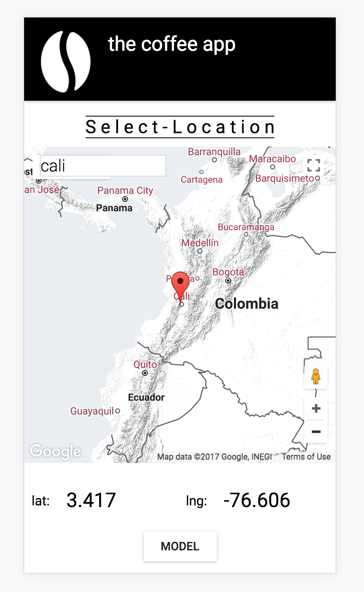

# the-coffee-app

A app that incorporates a state of the art eco-physiological model of coffee yield predictions allowing anyone to get coffee yield predictions from anywhere
in the world.

### Screen shots
Map and mainpage | user input and settings
----------------:|:-----------------------
 | 

###Tech stack
React-redux, react, R, JS, koa, google-maps api collaboration with ETH Zurich

### Model

###
